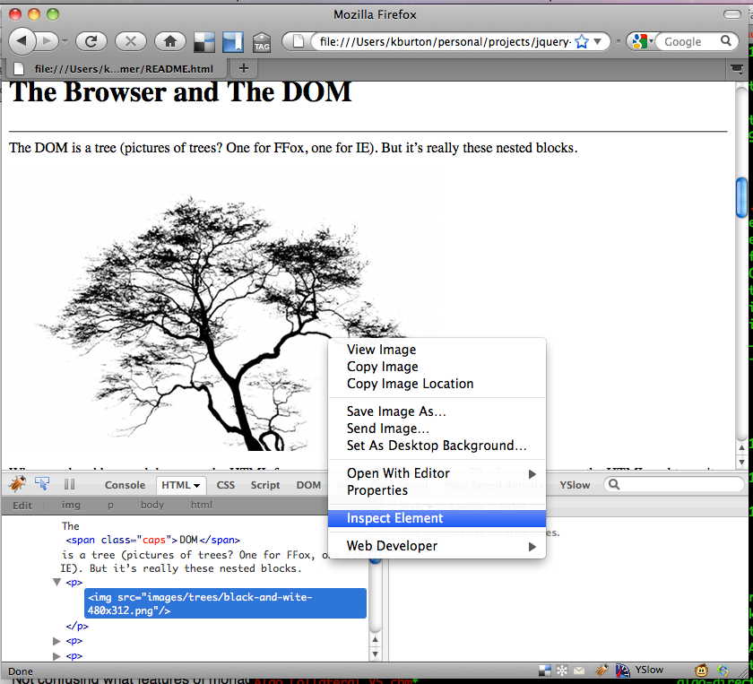

h1. Overview

This is a primer on not just jQuery, but an introduction to how HTML, CSS, the DOM and Javascript fit together.  I hope to get you bootstrapped enough to be able to create basic interactive web pages.  I'm not going to cover internals of a particular browser or cross-browser incompatibiltiy issues (jQuery masks a lot of that on the javascript side, and from the perpsective of CSS, my experience has been that it's a very long list of specific fixes and hacks).  I'm also not going to cover any back-end technology stack - my goal is to get you introduced to the front-end of the web stack, and a few tools and libraries to make working there more productive and fun.

h1. Tools

The tools I use and will be talking about are all available as open-source.  You can obtain them all easily and there are links in the reference section at the end.

* Firefox Web Browser
* FireBug Firefox Extension
   For interacting with your and other web pages
* jQueryify Plugin
   For inspecting how effects in other pages were acheived
* The Gimp
   For image manipulation and creating graphics

Firefox may not be the most widely used browser, and you should certainly test your site thoroughly with the browsers your target demographic most widely uses (most likely the Internet Explorer family of browsers), but I've found the development toolset to be fairly rich and Firefox runs on all the platforms where I perform development (Linux and Mac OS X).

I have used YSlow from Yahoo for helping to optimize the download time and rendering performance of your web app, and a few other tools, though I'm not going to cover them here they very much are worth looking into.

h1. HTML

HTML is where it all begins (at least for your front end).  The HTML for your site defines the overall shape and the content in the pages.  When HTML was first widely used, it mixed together the structure, content and the layout and presentation (styling) all in the same markup.  Now it is conventional to separate out the styling and some of the layout from the content and reserve the use of HTML for overall structure and layout.  Styling information is separated out into CSS.  Javascript gives you the ability to implement applicaiton behavior on the front end without requiring server side interaction.  This can be to change content in the page, perform some error checking to help the user, and to fetch data without a full page refresh.  These techniques make for a richer and often better performing experince using your web application.

h1. The Browser and The DOM

When rendered by a web browser, the HTML for your page is effectively a tree.  The browser parses the HTML and turns it into a data structure with a root node (the 'documet' node) and many branches and leaves hanging off of the root.  Nodes can have attributes (eg: id, class, href, and so on), as well as content (like the body of a paragraph tag).  The browser will present this tree to your JavaScript in a form called DOM.  DOM stands for Document Object Model and was standardized (quite a while ago) by the W3C (World Wide Web Consortium).  The DOM represents both the structure of the tree (Nodes and children) and a well defined API (set of functions) for getting at the data in the tree as well as navigating and searching the page.

The DOM api is a bit tedious to use for things like searching and modifying the tree though, thankfully libraries like jQuery provide a greatly simplified way of traversing, searching and modifying the HTML document.

When you look at the browser you can't really see any of this though.  Even viewing the source for the page doens't really show you the structure of the DOM.  FireBug does.  It lets you look at quite a bit of what is going on behind the scenes.

That's FireBug there, sitting at the bottom of the browser (you can pull it up by clicking on the little bug in the lower status bar, or by pressing F12).  In the screenshot, I've right-clicked on an element I'm interested in finding out more about and chosen 'Inspect Element'.  FireBug then shows me that element in the hierarchical HTML for the page.

Once you've got the structure and content into your pages the next thing you'll want to do is customize how they look: fonts, sizes, colors, alignment and so on.  That brings us to...

h1. CSS

What is CSS?   Cascading Style Sheets is what the acronym stands for, but what is it?  How do you use it?  CSS was introduced so that the styling of your pages could be separated from its content.  Instead of using HTML tags and attributes to do thigns like set colors, background images or font styling, CSS allowed those aspects to be specified separately.  It allows them to be easily changed without having to change the HTML.  In highly dynamic websites this is a blessing because it means you can change things like fonts without having to write new application code.  It also allowed designers to expirement with different stylings easily by only making changes in the CSS files.

So, how does CSS work?  CSS files have a simple structure, they specify a selector and a styling block.  The selector determines which elements the styling is applied to.  The selectors and styling are also cascading - when an element is matched by more than one selector, it takes on all the styling attributes from the related CSS blocks, with conflicting attirbutes being overriden by the last one specified.

The best way I've come up with to think about CSS selectors is that CSS sees the DOM as a 'paint by numbers' canvas, with each HTML tag being a region and the selectors being used to identify the region.

(

show a paint by numbers picture, simple, then complex

searched flickr for 'paint by number' and 'color by number' but couldn't find what I was looking for.  Shouldn't be hard to do one though, maybe start with a coloring book stencil.

This could be a good one:

 http://www.flickr.com/photos/joe_wentzel/3958684728/sizes/l/

)

In each region you can put a class (like a number), then separetly you deifne the 'key' or table which describes how to paint each of those regions.

(show a picture of a DOM/Grid with the numbers, then a slide of a css definition / key / table, then the blank grid filled in with some of the style).

This the simplest analogy I could come up with.

Now CSS also supports IDs.  You use classes when there is more than 1 region (element) that you want that style to apply to.  You use an ID when it is supposed to be unique.  This distinction between classes and IDs will become more important when you start making your application interactive.  I'll touch on it a bit later.

.h2 jQuery and JavaScript

.h3 Navigation

So, the DOM is a tree (show the pic of the grid).  When you want to decouple your logic from your presentation, how do you attach behaviors or change the elements in the DOM?  To do this you need some way of addressing the leaves, or nodes, of the tree (DOM).  There are a few ways to do this, one (which I don't recommend) is to sprinkle your javascript and styles all throughout the tree itself, right within the HTML.

Another is to use XPath, though I'm not really going to talk about that since it's more brittle, and there's a better way...

Remember all those CSS classes and IDs you put in your DOM to define how things should look?  jQuery lets you use those to find and manipulate the Nodes.  Deciding to support CSS selectors in javascript really was a brilliant idea.

.h3 Navigation via CSS

(show the picture of the nested boxes, this time with css classes and IDs in them)

This can be as simple as asking for the element with an ID:

  $('#login-submit-button')

Or all the elements with a particular class:

  $('.green-background')

Note that in both cases jQuery returns an array, since it can't tell how many elements will come back.

You can also select nodes by their tag, and you can combine classes, IDs and tags:

  $('tr.green-background');

  $('button#login-submit-button')

Though in the case of IDs, if you're doing it right, only 1 element will have an ID anyway.

Once you have a node (or set of nodes), jQuery lets you search within those nodes.  This allows you to narrow your search through the tree without necessarily having to apply classes or IDs.

If you knew you were after some '' tags, but you only wanted the ones within table cells and no where else, you could first look for all the cells, then the containing spans:

  var cells = $('td');
  var spans = $(cells).find('span');

jQuery also allows you to use some relative positioning in your query, eg: to assert that you want the children of a particular parent:

  var spans = $('td > span');  VALIDATE THIS

This is the previous example done in one step.

.h3 jQuery Events

.h3 jQuery DOM Manipulation

Swap / toggle classes

Set / clear the HTML

Add / remove classes

.h3 jQuery Effects

.h2 Javascript

* Introduction
* Techniques
** 'countdown latch' approach for lightboxes / dialogs and for coordinating on multiple ajax requests completing (or erroring)

$($x('//*')).css("border", "solid green 1px");

$('*').css("border", "solid yellow 1px");

